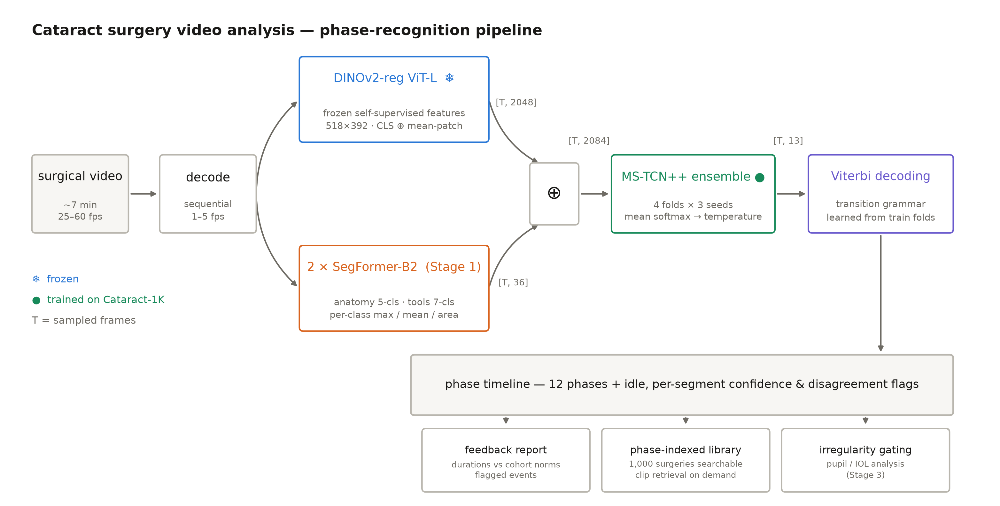

# PhacoSight

**Cataract surgery video analysis for resident physician education.**

PhacoSight processes recordings of cataract surgeries and turns them into structured,
reviewable feedback for the operating resident: what happened, when, how long each step
took, and how the surgery compares to a cohort of peers.



## What it does

1. **Semantic segmentation** of anatomy (cornea, pupil, lens) and surgical instruments
   per frame.
2. **Phase recognition and timing** — the twelve action phases plus idle periods, with
   per-phase durations and transitions.
3. **Generated reports** summarizing the procedure: phase timeline, instrument usage,
   notable events and irregularities (e.g. pupil contraction, IOL rotation).
4. **Annotated review** — feedback and annotated frames for residents reviewing their
   own surgeries, with per-prediction confidence flags.
5. **Per-phase instrument-movement feedback** — kinematic metrics (path length,
   velocity, smoothness, decentration) per surgical step, compared against cohort norms.
6. **Phase-indexed video library** — analyzed surgeries are searchable by step
   ("all main incisions") with matching clips retrieved and downloadable.

Design docs, experiment write-ups, and PI reviews live in [`docs/`](docs/) — start with
[`docs/experimentation-plan.md`](docs/experimentation-plan.md), then the stage results
([`docs/stage1-segmentation-bakeoff.md`](docs/stage1-segmentation-bakeoff.md),
[`docs/stage2-phase-results.md`](docs/stage2-phase-results.md)).

## Repository layout

| Path | Contents |
| --- | --- |
| `src/phacosight/` | The Python package: labels, datasets, folds, models, phase pipeline |
| `scripts/` | Entry points: training, evaluation, feature extraction, bulk analysis |
| `configs/` | YAML configs for the segmentation and phase-recognition experiments |
| `app/` | Physician-facing web app (FastAPI + vanilla JS) |
| `tests/` | CPU smoke tests with synthetic data (no dataset download needed) |
| `docs/` | Experimentation plan, results, reviews, figures, dataset description |
| `Dataset_codes/`, `TrainIDs_*/` | Upstream Cataract-1K preprocessing scripts and committed cross-validation splits (see [Data](#data)) |

## Setup

```bash
git clone https://github.com/jdlaurence/phacosight.git && cd phacosight
python -m venv .venv
.venv/bin/pip install -e ".[dev,app]"        # add [gpu] on a CUDA machine, [data] for downloads
.venv/bin/python -m pytest tests/ -q         # smoke tests, no data required
```

Download the datasets (requires a [Synapse](https://www.synapse.org) account and
`SYNAPSE_AUTH_TOKEN`):

```bash
.venv/bin/python scripts/download_data.py --sets segmentation phase   # → data/
```

## Training

Segmentation (dual-GPU preferred; plain `python` works single-GPU/CPU):

```bash
.venv/bin/torchrun --standalone --nproc_per_node=2 scripts/train_seg.py \
    --config configs/seg_segformer_b2.yaml --fold 0    # or --fold all
```

Phase recognition:

```bash
.venv/bin/python scripts/train_phase.py --config configs/phase_mstcnpp_tools_1fps_seed0.yaml
```

Splits are patient-wise and committed under `TrainIDs_*/`; class-ID conventions are
codified in `src/phacosight/labels.py` and mirror the upstream mask scripts exactly, so
results remain comparable to the Cataract-1K paper's benchmarks.

## Physician web app

```bash
.venv/bin/python -m app        # or `phacosight` once installed
```

Then open http://localhost:7860 (from a workstation: `ssh -L 7860:localhost:7860 <host>`).
Browse analyzed surgeries on an interactive timeline synced to video, compare per-phase
durations against cohort percentiles, search the phase library, and upload new videos
for GPU analysis. See [`app/README.md`](app/README.md).

## Data

PhacoSight is trained and evaluated on **[Cataract-1K](https://arxiv.org/pdf/2312.06295.pdf)**
(Ghamsarian et al.): 1000 cataract surgery videos with phase annotations for 56 videos,
pixel-level anatomy/instrument annotations for 2256 frames from 30 videos, and
irregularity subsets. The dataset itself is **not** in this repository — it is
downloaded from Synapse. The upstream preprocessing scripts (`Dataset_codes/`) and
cross-validation split CSVs (`TrainIDs_*/`) are retained from the
[dataset-release repository](https://github.com/Negin-Ghamsarian/Cataract-1K); the full
upstream dataset description is preserved at
[`docs/cataract-1k-dataset.md`](docs/cataract-1k-dataset.md).

### Download

If you agree to the license conditions below, you are free to download the following:

*   [Catatact-1k](https://www.synapse.org/#!Synapse:syn53404507) (89.9 GB)
*   [Phase Recognition Set](https://www.synapse.org/#!Synapse:syn53395146) (3.87 GB)
*   [Semantic Segmentation Set](https://www.synapse.org/#!Synapse:syn53395479) (4.74 GB)
*   [Lens Irregularity Set](https://www.synapse.org/#!Synapse:syn53395131) (1.49 MB)
*   [Pupil Reaction Set](https://www.synapse.org/#!Synapse:syn53395402) (3.29 MB)
*   [Dataset Preparation Codes](https://github.com/Negin-Ghamsarian/Cataract-1K)

### Citation

The Cataract-1K datasets are licensed under
[Creative Commons Attribution 4.0 International (CC BY 4.0)](https://creativecommons.org/licenses/by/4.0/legalcode);
a reference must be made to the following publication when the dataset is used in any
academic or research report:

Ghamsarian, N., El-Shabrawi, Y., Nasirihaghighi, S., Putzgruber-Adamitsch, D.,
Zinkernagel, M., Wolf, S., Schoeffmann, K., Sznitman, R.: Cataract-1K: Cataract Surgery
Dataset for Scene Segmentation, Phase Recognition, and Irregularity Detection

BibTeX:

```
@inproceedings{Cataract-1K,
    author    = {Negin Ghamsarian and
                Yosuf El-Shabrawi and
                Sahar Nasirihaghighi and
                Doris Putzgruber-Adamitsch and
                Martin Zinkernagel and
                Sebastian Wolf and
                Klaus Schoeffmann and
                Raphael Sznitman},
    title     = {Cataract-1K: Cataract Surgery Dataset for Scene Segmentation, Phase Recognition, and Irregularity Detection (to appear)},
    
}
```
