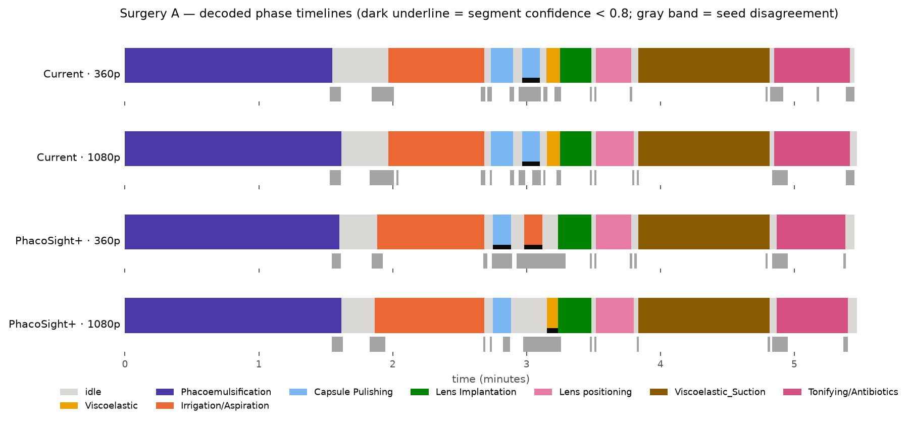
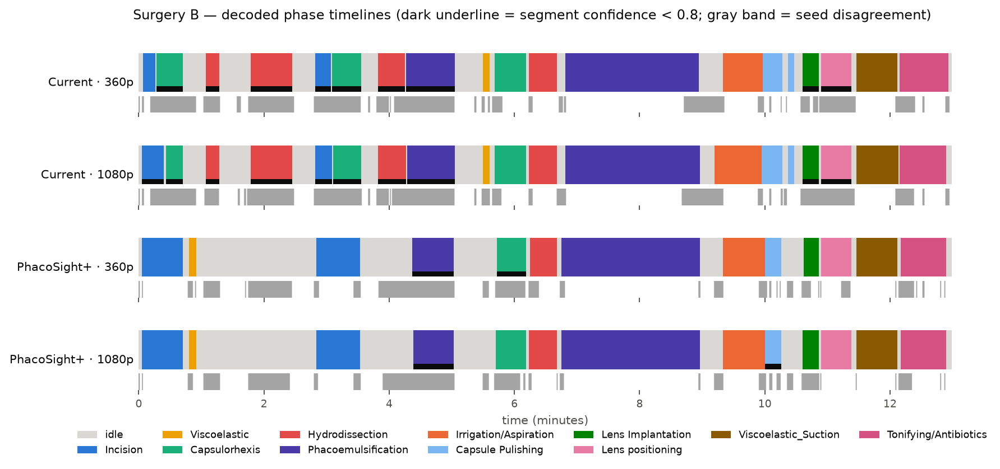
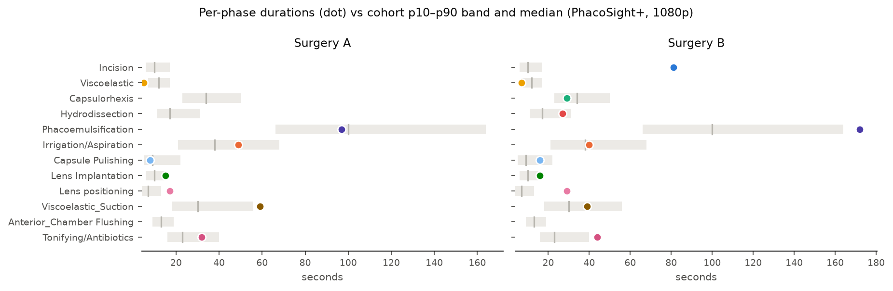

# Collaborator videos — generalization report

*2026-08-18. Two surgeries from a collaborator's clinic (a third surgical site: recorder,
optics, and workflow unseen by any training data), each analyzed at two export
resolutions (360p / 1080p) by two stacks: **Current** (Cataract-1K-only, the pre-E7
deployment) and **PhacoSight+** (E7-b, the newly adopted CATARACTS-augmented stack).
No ground truth exists for these videos; all evidence is label-free (cross-stack and
cross-resolution agreement, ensemble confidence, grammar checks, frame inspection).
Uploads never enter cohort norms or training.*

## Timelines

## Durations vs cohort norms

## Findings

1. **Surgery A is a partial recording (starts mid-phacoemulsification)** and both
   stacks handle it identically and confidently: 91–94% frame agreement, mean
   confidence ≈0.93, one flagged segment each, durations within cohort bands. The
   pipeline degrades gracefully on clipped inputs.
2. **Surgery B separates the stacks — and the augmented stack wins the disputes.**
   Agreement drops to ~78%, concentrated in the first 7 minutes. The Current stack
   fragments the opening into 19 segments with **half flagged low-confidence**
   (rhexis at 0:30, hydrodissection before the main incision — surgically incoherent);
   PhacoSight+ produces 13 segments, 2 flagged, in canonical order. A frame-level
   inspection of the disputed boundaries sided with PhacoSight+ at every adjudicable
   point (e.g. the keratome appears at ~3:10, exactly where it places the main
   incision; the 0:30 activity is peripheral prep, not rhexis).
3. **Resolution robustness favors the augmented stack.** Between 360p and 1080p exports
   its timelines agree 94.8% (A) and **99.5%** (B) versus the Current stack's 98.5% /
   96.4%. Practical guidance for the clinic: 1080p exports are preferred, but the
   augmented stack's analyses are already stable at 360p.
4. **Zero grammar violations in all eight runs** — even pre-decoding, both stacks emit
   surgically legal transition sequences on this third-site data.
5. **Cohort comparison flags are plausible:** Surgery B reads as a slower case — phaco
   duration at the cohort's p90 edge and an incision-phase total (81 s) far above the
   p90 (17 s). Caveat: the model attributes all early instrument work to Incision, so
   this number likely merges side-port/prep activity; treat it as "extended opening
   phase," not a precise knife-time measurement.
6. **One shared oddity, honestly flagged:** both stacks report a brief
   phaco-handpiece-like segment at ~4:30 in Surgery B, *before* capsulorhexis —
   possibly handpiece priming at the wound. Both mark it and its neighborhood with
   elevated seed disagreement; it is exactly the kind of segment the confidence layer
   exists to surface for physician review.

## Bottom line

On genuinely out-of-domain clinic video, the CATARACTS-augmented stack produced
cleaner, more confident, more resolution-stable, and surgically more coherent timelines
than its predecessor — consistent with its +20pp cross-center gain on held-out
CATARACTS test. The confidence layer behaved as designed: it concentrated flags on the
one genuinely ambiguous region rather than blanketing the video.

*Provenance: promoted E7-b stack (12-head ensemble, T=1.016, C1K grammar), rebuilt
cohort norms (n=1030), auto 4:3 crop for 16:9 uploads; stats in the run records.*
